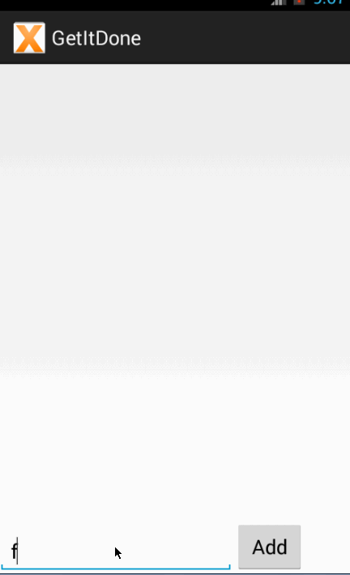

# Get It Done for Android

This is an Android application for creating and editing a to-do list. This is a project for the CodePath Intro to Android Bootcamp which you can sign up for at (http://codepath.com/androidbootcamp).

Time spent: 5 hours spent in total

Completed user stories:

 * [x] Required: User can type a new task and click a button to add it to the list
 * [x] Required: User can remove a task from the list by long-clicking the task
 * [x] Required: User's to-do list is saved and recalled the next time user opens the app
 * [x] Required: User can edit the text of a task by tapping the task
 
Notes:

Most basic functionality. Would like to add priority and sorting by priority in the future.

Walkthrough of all user stories:

GIF created with [LiceCap](http://www.cockos.com/licecap/).
